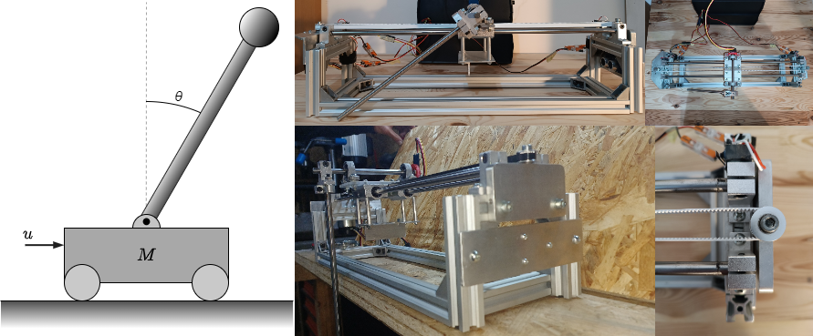
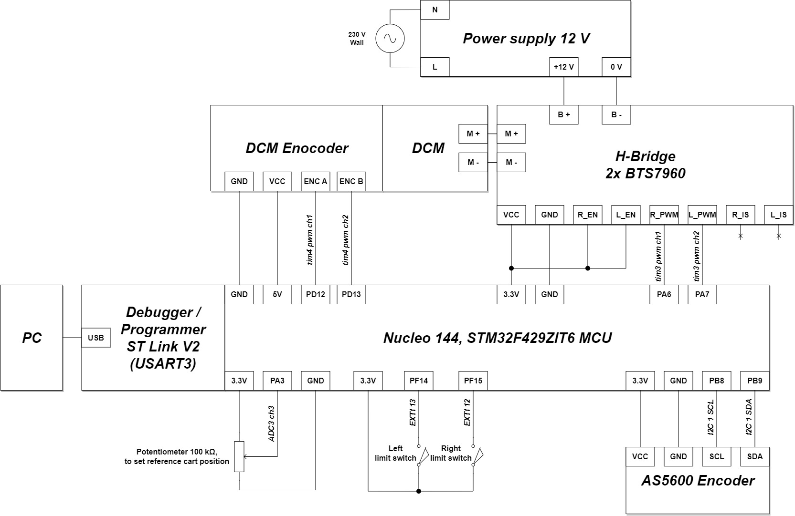

# About
This is apppliation for stm32f4 with freeRTOS+CLI for control of linear inverted pendulum (abbr. LIP). Control system is based on full state feedback with DC motor voltage deadzone compensation.

Control system is based on full state feedback with DC motor voltage deadzone compensation. Control scope includes stabilization of pendulum arm in up position, oscillation damping in arm down position and swingup. Swingup works in open-loop, the trajectory of input voltage was calculated by method of dynamic system trajectory optimization.

Some low-pass filters are implemented for numerical derivatives, by discretizing $\mathrm{G}(\mathrm{s})=\frac{1}{\mathrm{T}\mathrm{s}+1}$  transfer function. Project includes basic implementation of some FIR and IIR filters which were not used in the final control functionality.

App has its own CLI (*Command line interface*) based on FreeRTOS CLI command interpreter ported to work with stm32f4. CLI works over the same uart as the debugger so that there is no need to connect another USB cable to the board.

In the beginning the project base code was autogenerated using STM32 CubeMX and it's located under Core/ directory. LIP App is separated from autogenerated code and is located under LIP/ directory. Later project was moved from cubeIDE enviroment into CMake and Makefile. CMake based build can be started by using *makefile* in the project root location. It more or less acts as a wrapper for cmake commands, this makefile is based on [github/prtzl/stm32](https://github.com/prtzl/stm32/tree/master) base project.

Python/matlab part that includes more mathematical parts of the project:\
[github/bubleBoble/LIPMatlab](https://github.com/bubleBoble/invertedPendulumPythonMatlabOptimizationMath)

## Hardware setup:


## Electronic modules connections:



# Board view
    Two arduino compatibile shields were used to ease wired connections
    built-in blue button is at PC13
    [ ] - not used
    [x] - used

                                ________________________________________________________________
                                |                                                              |
                                |                   ST link debugger/programmer                |
                                ________________________________________________________________ arduino shield 1 starts here (with grove connectors)
                                |                                                       [ ][ ] |   PB8 I2C1_SCL
                                |                                                       [ ][ ] |   PB9 I2C1_SDA
                                |                              ----------------------------------- arduino shield 2 starts here
                                | [ ][ ]                       |                        [ ][ ] |
     ard. shield 2 ____________ | [ ][ ]_______________________|                        [ ][ ] |
                                | [ ][ ]                                                [ ][ ] |
                   3.3V         | [x][ ]                                                [ ][x] |   PA6 (pwm tim3 ch1)
                     5V         | [x][ ]                                                [ ][x] |   PA7 (pwm tim3 ch2)
                    GND         | [x][ ]                                                [ ][ ] |
                                | [ ][ ]                                                [ ][ ] |
                                | [ ][ ]                                                [ ][ ] |
                                |                                                              |
       PA3 (adc_pot / ADC3/3)   | [x][ ]                                                [ ][x] |
                                | [ ][ ]                                                [ ][ ] |
     PC3 (adc_dcm_R_i ADC3/13)  | [x][ ]                                                [ ][ ] |
     PF3 (adc_dcm_L_i ADC3/9)   | [x][ ]                                                [ ][x] |   PF14 limit NO switch left EXTI 13
                                | [ ][ ]                                                [ ][ ] |
                                | [ ][ ]                                                [ ][x] |   PF15 limit NO switch right EXTI 12
                                | [ ][ ]                                                [ ][ ] |   PG14
                                | [ ][ ]                                                [ ][ ] |   PG9
                                ---------------------------------------------------------------- arduino shield 1&2 ends here
                                | [ ][ ]                                                [ ][ ] |
                                | [ ][ ]                         PD13 (enc tim4 ch2)    [x][ ] |
                                | [ ][ ]                         PD12 (enc tim4 ch1)    [x][ ] |
                                | [ ][ ]                                                [ ][ ] |
                                | [ ][ ]                                                [ ][ ] |
                                | [ ][ ]                                                [ ][ ] |
                                | [ ][ ]                                                [ ][ ] |
                                | [ ][ ]                                                [ ][ ] |
                                | [ ][ ]                                                [ ][ ] |
                                ________________________________________________________________


# Notes

## Note 1:
From FreeRTOS/portable leave:
```
    portable/GCC/ARM_CM4F
    portable/GCC/MemMang/heap4.c is fine
```
rest of porable code has to be excluded from the build

## Note 2:
`FreeRTOSConfig.h` is located in LIP/include/FreeRTOSConfig.h

## Adding freeRTOS to stm32CubeIDE
1. Add src files to the build
   - FreeRTOS/Source/*.c

2. Add include paths
   - FreeRTOS/Source/include
   - FreeRTOS/Source/portable/GCC/ARM_CM4
     (remember about FreeRTOSConfig.h)

3. In cubemx / System Core / NVIC / code generation tab:
   - disable "generate IRQ handler" for "System service call via SWI instruction"
   - disable "generate IRQ handler" for "Pendable request for system service"


## Dev board used
    Nucleo-144 stm32f429zi
    https://botland.com.pl/stm32-nucleo/5527-stm32-nucleo-f429zi-stm32f429zit6-arm-cortex-m4-5904422364939.html

## GPIOs for motor pwm (TIM3)
    PA6 for CH1 (alias pwm1_dcmA1)
    PA7 for CH2 (alias pwm2_dcmA2)


    Timer for PWM motor control is tim3 (htim3)
    (APB1@84MHz) on CH1 & CH2
    PSC set to 83 (84)
    ARR set to 999 (1000)
    Auto-reload preload: enabled
    Counter mode: up
    Pwm freq = 1kHz

## Add float formatting support for sprintf
In newlib-nano the float formatting support is not enabled by default, 
check your MCU Settings from "Project Properties > C/C++ Build > Settings > Tool Settings", 
or add manually `-u _printf_float` in linker flags.

## For FPU
1. FPU initialization
    ```C
    SCB->CPACR |= ((3 << 10*2)|(3 << 11*2));
    ```

2. Float ABI selection
    ```C
    -mfloat-abi=xxx
    // xxx = soft/softfp/hard
    ```
3. FPU selection
    ```C
    -mfpu=xxx
    // xxx = fpv4-sp-d16
    ```

4. Default all floating point constant in source to single precision floats
    ```C
    -fsingle-precision-constant
    ```

5. Warn about float to double promotion
    ```C
    -Wdouble-promotion
    ```

6. Use fast math 
    ```C
    -ffast-math
    ```

## AS5600 - Grove 12 bit Magnetic Rotary Position Sensor / Encoder
    4096 positions per round.
    The output is selectable, you can either use the I2C
    interface to output the RAW data or output
    the PWM wave/Analog wave via the OUT pin.

    18DEG TO 360DEG
    MAX ANGLE IS PROGRAMMABLE FROM 18DEG TO 360DEG


                |                              |
                |                  S       [1] |   GND
         GND    | [1]   G          O P     [5] |   3V3
         VCC    | [2]   R          L I     [6] |   PG0 - INIT PROGRAMMING TO SET INIT AND END POSITION
         SDA    | [3]   O          D N     [3] |   SDA
         SCL    | [4]   V          E S     [4] |   SCL
                |	    E          R       [7] |   OUT - OUTPUT DUTY CYCLE SIGNAL
                |                              |


    DEFAULT OUTPUT RANGE 0-360


    analog 12 bit output or pwm on out pin


    VCC on grove con. can be 5V or 3.3V


    max SCL freq = 1MHz


    Addresses
    Slave address: 0x36 (0b00110110)

    links:

    links:
        https://www.reddit.com/r/embedded/comments/sebcb5/c_driver_for_ams_as5600_magnetic_position_sensor/
        https://github.com/raulgotor/ams_as5600
        https://github.com/RobTillaart/AS5600/tree/master

## Nice tools & websites
### Serial oscilloscope (Windows only)
    https://x-io.co.uk/serial-oscilloscope/

### ASCII art
    https://asciiflow.com/#/
    https://textik.com/#d16005307bf5261a

### ASCII tables
    https://tableconvert.com/ascii-generator
    https://www.tablesgenerator.com/text_tables
    https://textart.io/table

## Make freeRTOS cli better
    https://www.edwinfairchild.com/2022/10/making-freertos-cli-more-cli-ish.html

## Data type sizes arm gcc
    https://developer.arm.com/documentation/dui0491/i/C-and-C---Implementation-Details/Basic-data-types

