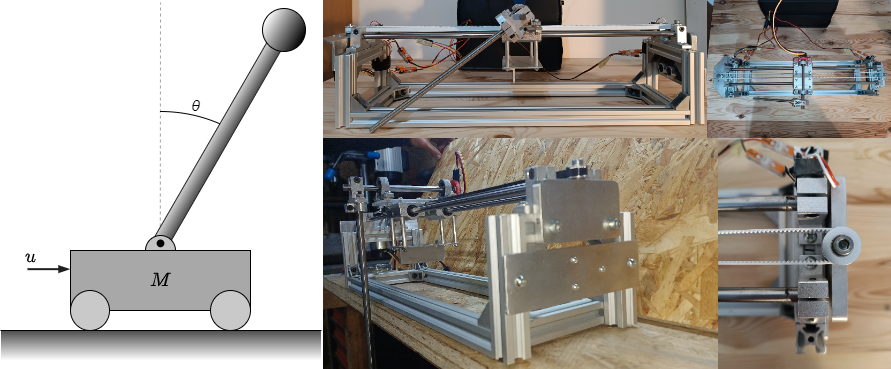
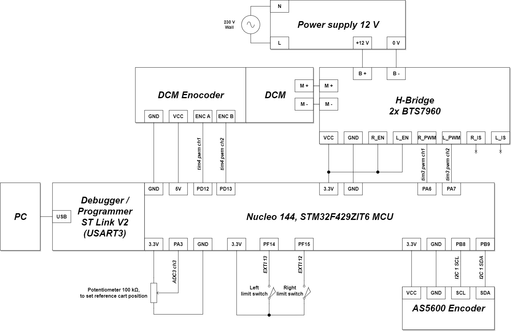

# About (short)
This is an application for the STM32F4 microcontroller with FreeRTOS + CLI over
UART, designed to control a linear inverted pendulum.


Python/matlab part that includes more theoretical parts of the project:
  - [github/bubleBoble/LIPMatlab](https://github.com/bubleBoble/inverted-pendulum-python-matlab-optimization-math)

Videos of real device and simulation:
  - https://www.youtube.com/playlist?list=PLLyk_frqcOGw6XyiyMOqAa3b0tapfJQMq

# Tools, Project Structure, Compilation
## Target platfom
Project was compiled for STM32F429ZI MCU. Tested on STM32F429ZI Nucleo board.

## Prerequisites
This project was compiled using the following tools with respective versions:
  - **cmake** - **3.12**
  - **make** - GNU Make **4.4.1**
  - **arm-none-eabi toolchain** version **10.3.2021.10-x86_64** - [download here](https://developer.arm.com/downloads/-/gnu-rm)
  - **podman** - **5.3.2**

ST/ARM Drivers:
  - **CMSIS** - 5.6.0 (`cmsis_version.h`) - [github repo](https://github.com/ARM-software/CMSIS_5)
  - **STM32F4xx_HAL_Driver** - v1.8.2.0 (`stm32f4xx_hal.c`) - [github repo](https://github.com/STMicroelectronics/stm32f4xx-hal-driver)

## Project structure
From the repository root:
  - [Core](./core) - ST CubeMX generated code
  - [Drivers](./Drivers) - CMSIS and HAL drivers
  - [FreeRTOS](./FreeRTOS) - FreeRTOS source code
  - [FreeRTOS-CLI](./FreeRTOS-CLI) - FreeRTOS CLI source code
  - [LIP](LIP) - Business logic for the Inverted Pendulum (LIP - Linear
    Inverted Pendulum)
  - [build_make](./build_make) - Directory with Makefile to build the app with
    make alone
  - [build_podman](./build_podman) - Directory with `Containerfile` used to
    build the project inside Linux container
  - [startup_stm32f429xx.s](./startup_stm32f429xx.s) - startup script
  - [startup_stm32f429xx.s](STM32F429ZITx_FLASH.ld),
    [STM32F429ZITx_RAM.ld](STM32F429ZITx_RAM.ld) - linker scripts
  - [makefile](./makefile) - Top-level Makefile, used for convenience
     as a wrapper for building the project with CMake or inside a container


## Building
Project can be built using cmake, make alone or using cmake inside a Linux
container (based on this amazing template project
[link](https://github.com/prtzl/stm32)).

To see available build options run
```bash
make help
```

### Building using `make`
```sh
# Run it from 'build_make' directory
cd build_make
make help       # to see available options
make release    # or this
make debug      # or use this for debug config
```
All build artifacts and output binaries are stored in
[build_make/build](./build_make/build)

### Building using cmake
```sh
# run from repo root directory
make help       # to see available options
make release    # use this
make debug      # or use this for debug config
```
All build artifacts and output binaries are stored in
[build_cmake/debug](./build_cmake/debug) or
[build_cmake/release](./build_cmake/release)

### Build using cmake inside container
```sh
make help                    # to see available options
make podman-build-image      # Build container image
make podman-build-release    # run container to build the app
make podman-build-debug      # or use this for debug config
```

# About (Longer)
This is an application for the STM32F4 microcontroller with FreeRTOS+CLI,
designed to control a linear inverted pendulum (LIP). The control system is
based on full state feedback, with compensation for the DC motor voltage
deadzone.

The control system includes stabilization of the pendulum arm in the upright
position, oscillation damping in the downward position, and a swing-up
mechanism. The swing-up operates in open-loop mode, and the trajectory of the
input voltage is calculated using dynamic system trajectory optimization
(Matlab library `OptimTraj` by Mathew Kelly -
[source](https://www.mathworks.com/matlabcentral/fileexchange/54386-optimtraj-trajectory-optimization-library)).

Several low-pass filters are implemented for *"smoothing out"* numerical
derivatives by discretizing the transfer function
$\mathrm{G}(\mathrm{s})=\frac{1}{\mathrm{T}\mathrm{s}+1}$.
The project includes basic implementations of some FIR and IIR filters,
although these were not used in the final control functionality.

The application features its own CLI (*Command Line Interface*), based on the
FreeRTOS CLI command interpreter, which is ported to work with the STM32F4.
The CLI operates over the same UART as the STLink programmer/debugger.

Initially, the project’s base code was autogenerated using STM32 CubeMX. The
project was later moved from the CubeIDE environment to a CMake and Makefile
setup. The CMake-based build can be initiated using the makefile in the
project's root directory, which acts as a wrapper for CMake commands.
This makefile is based on the
[github/prtzl/stm32](https://github.com/prtzl/stm32/tree/master)
template project.

## Hardware setup:


## Electronic modules connections:



# Board view
    Two arduino compatibile shields were used to ease wired connections
    built-in blue button is at PC13
    [ ] - not used
    [x] - used

                                ________________________________________________________________
                                |                                                              |
                                |                   ST link debugger/programmer                |
                                ________________________________________________________________ arduino shield 1 starts here (with grove connectors)
                                |                                                       [ ][ ] |   PB8 I2C1_SCL
                                |                                                       [ ][ ] |   PB9 I2C1_SDA
                                |                              ----------------------------------- arduino shield 2 starts here
                                | [ ][ ]                       |                        [ ][ ] |
     ard. shield 2 ____________ | [ ][ ]_______________________|                        [ ][ ] |
                                | [ ][ ]                                                [ ][ ] |
     3.3V                       | [x][ ]                                                [ ][x] |   PA6 (pwm tim3 ch1)
     5V                         | [x][ ]                                                [ ][x] |   PA7 (pwm tim3 ch2)
     GND                        | [x][ ]                                                [ ][ ] |
                                | [ ][ ]                                                [ ][ ] |
                                | [ ][ ]                                                [ ][ ] |
                                |                                                              |
     PA3 (adc_pot / ADC3/3)     | [x][ ]                                                [ ][x] |
                                | [ ][ ]                                                [ ][ ] |
     PC3 (adc_dcm_R_i ADC3/13)  | [x][ ]                                                [ ][ ] |
     PF3 (adc_dcm_L_i ADC3/9)   | [x][ ]                                                [ ][x] |   PF14 limit NO switch left EXTI 13
                                | [ ][ ]                                                [ ][ ] |
                                | [ ][ ]                                                [ ][x] |   PF15 limit NO switch right EXTI 12
                                | [ ][ ]                                                [ ][ ] |   PG14
                                | [ ][ ]                                                [ ][ ] |   PG9
                                ---------------------------------------------------------------- arduino shield 1&2 ends here
                                | [ ][ ]                                                [ ][ ] |
                                | [ ][ ]                         PD13 (enc tim4 ch2)    [x][ ] |
                                | [ ][ ]                         PD12 (enc tim4 ch1)    [x][ ] |
                                | [ ][ ]                                                [ ][ ] |
                                | [ ][ ]                                                [ ][ ] |
                                | [ ][ ]                                                [ ][ ] |
                                | [ ][ ]                                                [ ][ ] |
                                | [ ][ ]                                                [ ][ ] |
                                | [ ][ ]                                                [ ][ ] |
                                ________________________________________________________________


# Notes

## Note 1:
From FreeRTOS/portable leave:
```
    portable/GCC/ARM_CM4F
    portable/GCC/MemMang/heap4.c is fine
```
rest of porable code has to be excluded from the build

## Note 2:
`FreeRTOSConfig.h` is located in LIP/include/FreeRTOSConfig.h

## Adding freeRTOS to stm32CubeIDE
1. Add src files to the build
   - FreeRTOS/Source/*.c

2. Add include paths
   - FreeRTOS/Source/include
   - FreeRTOS/Source/portable/GCC/ARM_CM4
     (remember about FreeRTOSConfig.h)

3. In cubemx / System Core / NVIC / code generation tab:
   - disable "generate IRQ handler" for "System service call via SWI instruction"
   - disable "generate IRQ handler" for "Pendable request for system service"

## FreeRTOS-CLI demo
https://www.freertos.org/FreeRTOS-Plus/FreeRTOS_Plus_IO/Demo_Applications/LPCXpresso_LPC1769/NXP_LPC1769_Demo_Description.html

## GPIOs for motor pwm (TIM3)
  - PA6 for CH1 (alias pwm1_dcmA1)
  - PA7 for CH2 (alias pwm2_dcmA2)

  - Timer for PWM motor control is tim3 (htim3) (APB1@84MHz) on CH1 & CH2
    - PSC set to 83 (84)
    - ARR set to 999 (1000)
    - Auto-reload preload: enabled
    - Counter mode: up
    - Pwm freq = 1kHz

## Add float formatting support for sprintf
In newlib-nano the float formatting support is not enabled by default,
check your MCU Settings from "Project Properties > C/C++ Build > Settings > Tool Settings",
or add manually `-u _printf_float` in linker flags.

## FPU setup
1. FPU initialization
    ```C
    SCB->CPACR |= ((3 << 10*2)|(3 << 11*2));
    ```

2. Float ABI selection
    ```sh
    -mfloat-abi=xxx  # xxx = soft/softfp/hard
    ```
3. FPU selection
    ```sh
    -mfpu=xxx  # xxx = fpv4-sp-d16
    ```

4. Default all floating point constant in source to single precision floats
    ```sh
    -fsingle-precision-constant
    ```

5. Warn about float to double promotion
    ```sh
    -Wdouble-promotion
    ```

6. Use fast math
    ```sh
    -ffast-math
    ```

## AS5600 - Grove 12 bit Magnetic Rotary Position Sensor / Encoder
  - 4096 positions per round.
  - The output is selectable, you can either use the I2C interface to output the RAW data or output the PWM wave/Analog wave via the OUT pin.

  - MAX ANGLE IS PROGRAMMABLE FROM 18DEG TO 360DEG

```
                |                              |
                |                  S       [1] |   GND
         GND    | [1]   G          O P     [5] |   3V3
         VCC    | [2]   R          L I     [6] |   PG0 - INIT PROGRAMMING TO SET INIT AND END POSITION
         SDA    | [3]   O          D N     [3] |   SDA
         SCL    | [4]   V          E S     [4] |   SCL
                |	    E          R       [7] |   OUT - OUTPUT DUTY CYCLE SIGNAL
                |                              |
```

  - DEFAULT OUTPUT RANGE 0-360
  - analog 12 bit output or pwm on out pin
  - VCC on grove con. can be 5V or 3.3V
  - max SCL freq = 1MHz
  - Slave address: 0x36 (0b00110110)

  - links:
    - https://www.reddit.com/r/embedded/comments/sebcb5/c_driver_for_ams_as5600_magnetic_position_sensor/
    - https://github.com/raulgotor/ams_as5600
    - https://github.com/RobTillaart/AS5600/tree/master

## Nice tools & websites
### Serial oscilloscope (Windows only)
    https://x-io.co.uk/serial-oscilloscope/

### ASCII art & tables
  - https://asciiflow.com/#/
  - https://textik.com/#d16005307bf5261a
  - https://tableconvert.com/ascii-generator
  - https://www.tablesgenerator.com/text_tables
  - https://textart.io/table

### Make freeRTOS CLI better
  - https://www.edwinfairchild.com/2022/10/making-freertos-cli-more-cli-ish.html

### Data type sizes arm gcc
  - https://developer.arm.com/documentation/dui0491/i/C-and-C---Implementation-Details/Basic-data-types

# FreeRTOS naming conventions
Source: https://www.freertos.org/Documentation/02-Kernel/06-Coding-guidelines/02-FreeRTOS-Coding-Standard-and-Style-Guide
- Prefixes for variables:
  - ul - uint32_t
  - us - uint16_t
  - uc - uint8_t
  - x - prefix for non stdint typed variables
    - > Examples include BaseType_t and TickType_t, which are portable layer defined typedefs for the type that is the natural or most efficient type for the architecture, and the type used to hold the RTOS tick count, respectively
  - u - unsinged for non stdint types and `size_t`, e.g. `size_t uxDupa`
  - p - for pointer, e.g. pus - pointer to unsigned short (uint16_t *)
  - c - for chars permitted to hold only ASCII chars
  - pc - for pointers to ASCII strings (char **)
- Prefixes for functions:
  - prv - File scope static (private) functions
  - v - API functions are prefixed with their return type, as per the convention 
    defined for variables with the addition of the prefix v for void
  - API function names start with the name of the file in which they are defined. 
    For example vTaskDelete is defined in tasks.c, and has a void return type.